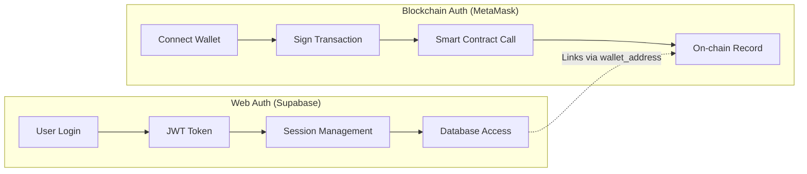
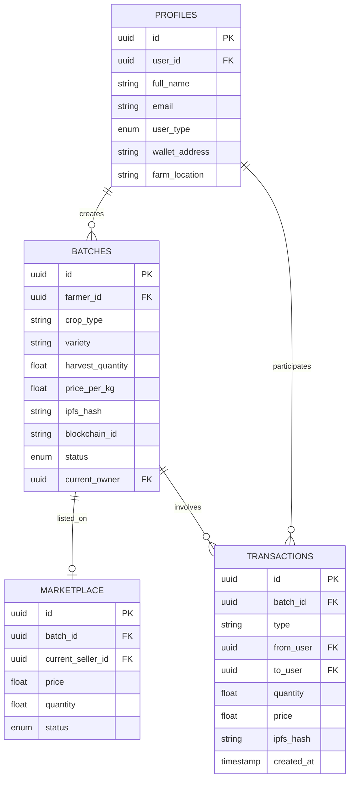
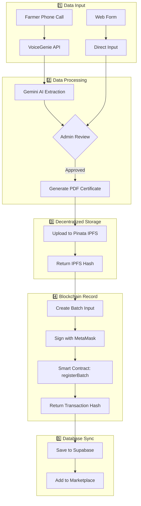
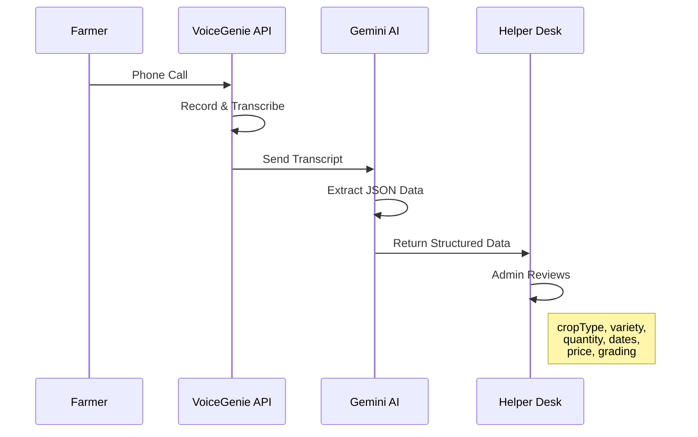
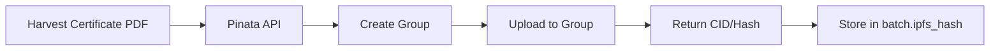
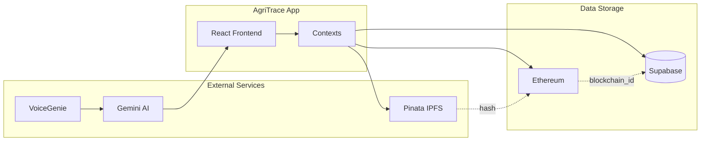

# 🔧 AgriTrace System Architecture

> Technical documentation for developers and system architects

---

## 📁 Project Structure

```
src/
├── components/       # Reusable UI components
├── contexts/         # React Context providers
│   ├── AuthContext.tsx      # Supabase JWT auth
│   └── Web3Context.tsx      # MetaMask wallet
├── contracts/        # Blockchain configuration
│   └── config.ts            # Contract address, ABI
├── hooks/            # Custom React hooks
│   └── useContract.ts       # Smart contract interactions
├── pages/            # Route components
├── services/         # External API integrations
│   ├── voicegenieService.ts         # VoiceGenie API
│   ├── geminiService.ts             # Google Gemini AI
│   └── voicegenieBatchRegistration.ts
├── utils/            # Utility functions
│   ├── singleStepGroupManager.ts    # Pinata IPFS upload
│   ├── blockchainTransactionManager.ts
│   └── transactionManager.ts
└── integrations/     # Supabase client
```

---

## 🔐 Hybrid Authentication Model

AgriTrace uses a **dual authentication system**:



### Supabase Auth (Web Session)
- **Purpose**: User identity, session management, database access
- **Token**: JWT stored in browser
- **Roles**: `farmer` | `distributor` | `retailer` | `admin` | `helper` | `driver`

### MetaMask Auth (Blockchain)
- **Purpose**: Sign transactions, interact with smart contract
- **Network**: Sepolia Testnet (Chain ID: `11155111`)
- **Contract**: `0xf8e81D47203A594245E36C48e151709F0C19fBe8`

---

## 🗄️ Database Schema



### Key Fields
| Table | Key Fields | Purpose |
|-------|-----------|---------|
| `profiles` | `wallet_address`, `user_type` | Links Web2 identity to Web3 wallet |
| `batches` | `ipfs_hash`, `blockchain_id` | Connects off-chain to on-chain data |
| `transactions` | `type`, `ipfs_hash` | Records supply chain events |

---

## 🔄 Batch Lifecycle

The complete flow from farmer registration to blockchain record:



---

## 📞 VoiceGenie Integration



### Extracted Data Structure
```typescript
{
  cropType: string,      // "Rice", "Wheat"
  variety: string,       // "Basmati", "HMT"
  harvestQuantity: number,
  sowingDate: string,
  harvestDate: string,
  pricePerKg: number,
  grading: string,       // "A", "B", "C"
  certification: string  // "Organic", "Standard"
}
```

---

## ⛓️ Smart Contract

**Contract**: `AgriTrace.sol` on Sepolia Testnet

### Key Functions

```solidity
// Register new batch
function registerBatch(BatchInput calldata input) external

// Transfer ownership
function transferBatch(uint256 batchId, address to) external

// Record purchase
function recordPurchase(
    uint256 batchId,
    address from,
    address to,
    uint256 quantity,
    uint256 price
) external
```

### Events Emitted
| Event | Parameters | Purpose |
|-------|-----------|---------|
| `BatchRegistered` | batchId, farmer, crop, ipfsHash, price | New batch created |
| `BatchOwnershipTransferred` | batchId, from, to | Ownership change |
| `PurchaseRecorded` | batchId, from, to, quantity, price | Transaction logged |

---

## 📦 IPFS Storage (Pinata)



### Storage Details
- **Gateway**: `https://gateway.pinata.cloud/ipfs/`
- **File Format**: PDF Certificate
- **Naming**: `{farmer}_{crop}_{variety}_{timestamp}`

---

## 🔗 Data Flow Summary



---

## 🛠️ Tech Stack

| Layer | Technology | Purpose |
|-------|------------|---------|
| **Frontend** | React + TypeScript | UI Components |
| **Styling** | Tailwind CSS + shadcn/ui | Design System |
| **Auth** | Supabase Auth | JWT Sessions |
| **Database** | Supabase (PostgreSQL) | Relational Data |
| **Blockchain** | Ethereum (Sepolia) | Immutable Records |
| **Smart Contract** | Solidity 0.8.20 | On-chain Logic |
| **Web3** | ethers.js v6 | Blockchain Interaction |
| **IPFS** | Pinata | Decentralized Storage |
| **AI** | Google Gemini | Data Extraction |
| **Voice** | VoiceGenie | Phone Registrations |

---

## 🔧 Key Services

### `voicegenieBatchRegistration.ts`
Orchestrates the complete batch registration:
1. Get/Create farmer profile
2. Generate certificate → Upload to Pinata
3. Register on blockchain
4. Save to database
5. Add to marketplace

### `singleStepGroupManager.ts`
Manages Pinata IPFS uploads:
- Creates file groups per batch
- Generates PDF certificates
- Returns IPFS hash (CID)

### `blockchainTransactionManager.ts`
Handles blockchain interactions:
- Records harvest transactions
- Records purchase transactions
- Manages signer state

---

*Last updated: AgriTrace v1.0*
