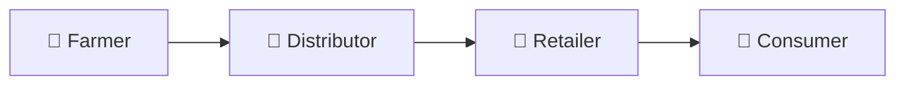
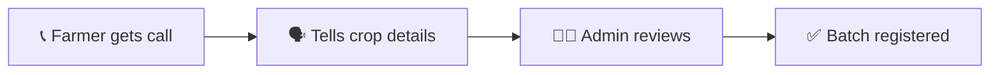
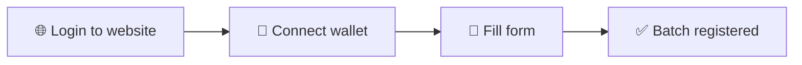
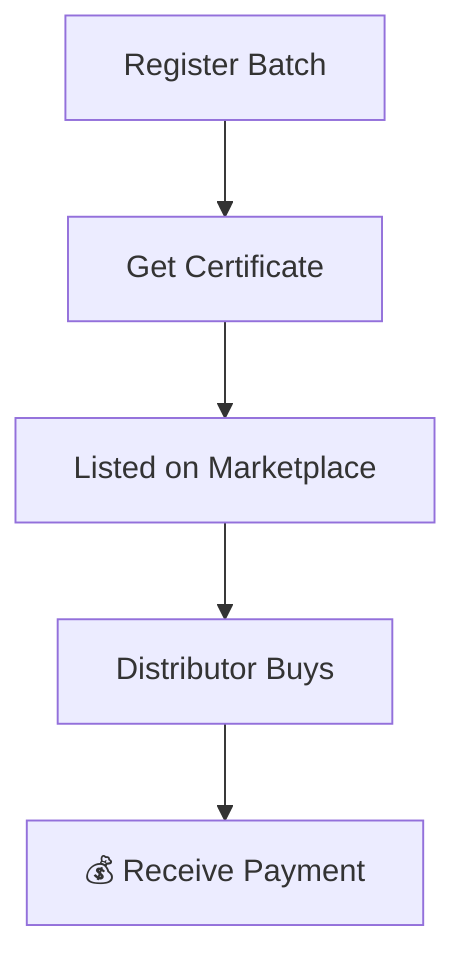
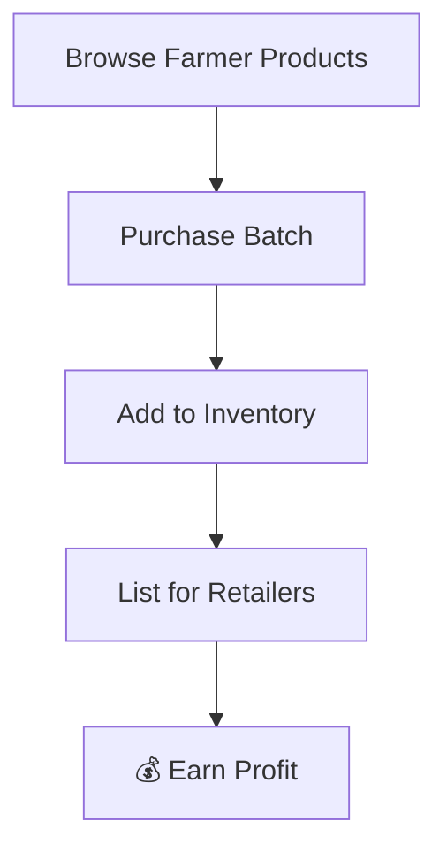
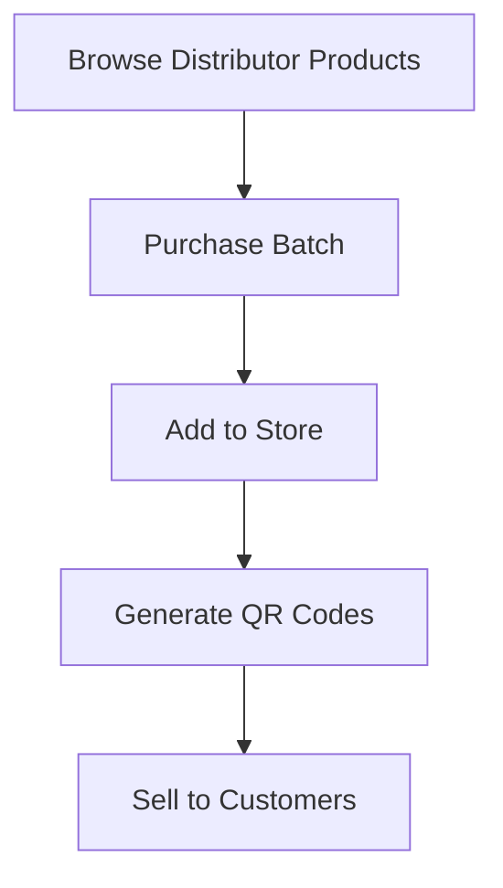
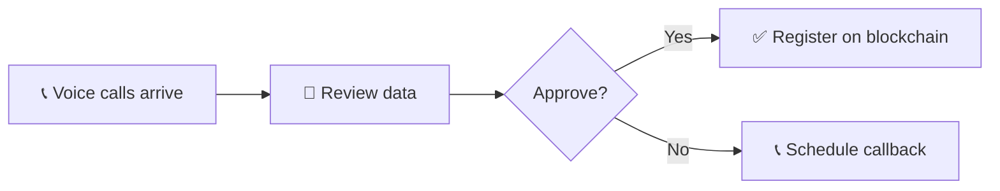
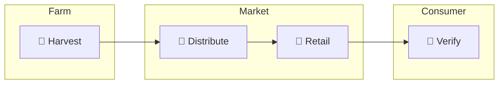

# 🌾 AgriTrace User Flow Guide

> Simple guide to how different users interact with AgriTrace

---

## 👥 Who Uses AgriTrace?

| User | What They Do |
|------|--------------|
| **Farmer** | Grows crops, registers batches, sells to distributors |
| **Distributor** | Buys from farmers, sells to retailers |
| **Retailer** | Buys from distributors, sells to consumers |
| **Consumer** | Scans QR code to verify product authenticity |

---

## 📱 Two Ways to Register

### Option 1: Phone Call (No Internet Needed)

**How it works:**
1. AI calls the farmer in their local language
2. Farmer shares crop details over the phone
3. Admin reviews and approves
4. Farmer gets SMS confirmation

### Option 2: Website (With Internet)

**How it works:**
1. Create account & login
2. Connect MetaMask wallet
3. Fill batch details form
4. Sign transaction & done!

---

## 🌾 Farmer Journey

**What farmers can do:**
- ✅ Register new crop batches
- ✅ Get blockchain certificates
- ✅ Sell to distributors
- ✅ Track all sales

---

## 🚚 Distributor Journey

**What distributors can do:**
- ✅ Buy directly from farmers
- ✅ Manage inventory
- ✅ Set prices for retailers
- ✅ Track purchases & sales

---

## 🏪 Retailer Journey

**What retailers can do:**
- ✅ Buy from distributors
- ✅ Generate product QR codes
- ✅ Prove product authenticity
- ✅ Build customer trust

---

## 🔍 QR Code Verification

**What consumers see:**
- 🌾 Farm origin & farmer name
- 📦 Crop type & quality grade
- 📅 Harvest date
- 🔗 Complete supply chain history

---

## 👨‍💼 Admin Helper Desk

**Admin responsibilities:**
- Review voice registrations
- Verify farmer data
- Approve or reject submissions
- Ensure data quality

---

## 🔄 Complete Product Journey

**The flow:**
1. **Farmer** harvests & registers crop
2. **Distributor** buys & transports
3. **Retailer** sells to public
4. **Consumer** scans QR to verify

---

## 🔑 Key Features

| Feature | Benefit |
|---------|---------|
| 📱 **QR Codes** | Instant product verification |
| ⛓️ **Blockchain** | Tamper-proof records |
| 📞 **Voice Registration** | No internet required for farmers |
| 📄 **Certificates** | Downloadable proof of origin |

---

## ❓ Quick FAQ

**Q: Do I need internet to register crops?**  
A: No! Farmers can register via phone call.

**Q: How do I verify a product?**  
A: Just scan the QR code on the product.

**Q: Is the data secure?**  
A: Yes, all records are stored on blockchain.

**Q: What wallet do I need?**  
A: MetaMask (free browser extension).

---

*AgriTrace - Transparency from Farm to Fork 🌾*
